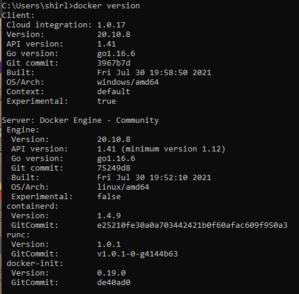
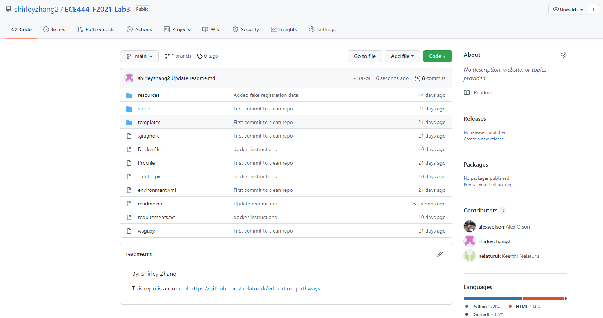
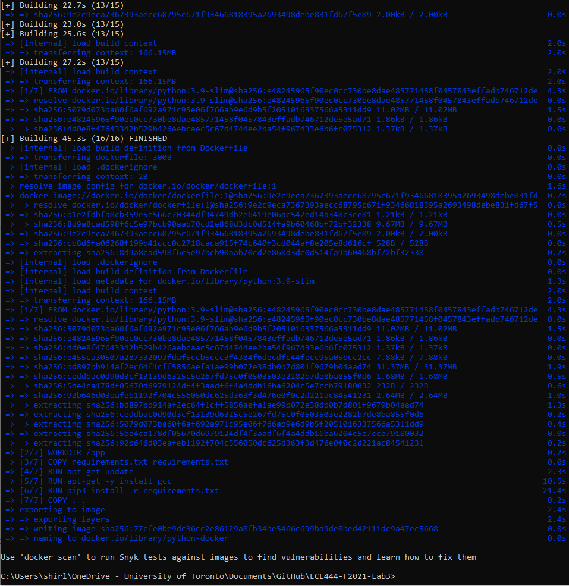
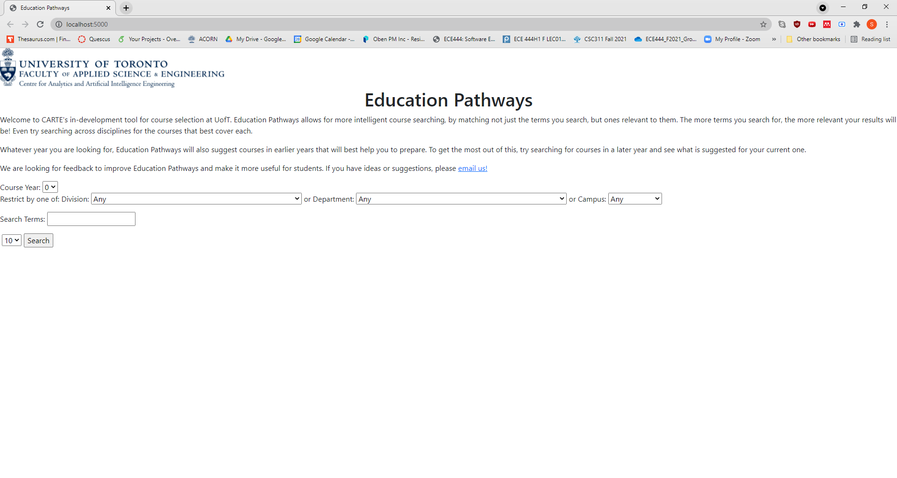
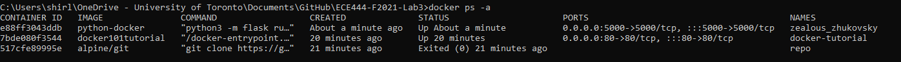

# ECE444-F2021-Lab2
By: Shirley Shuocheng Zhang

## Activity 1

## Activity 2
This repo is a clone of https://github.com/nelaturuk/education_pathways.

## Activity 3

## Activity 4

## Activity 5
