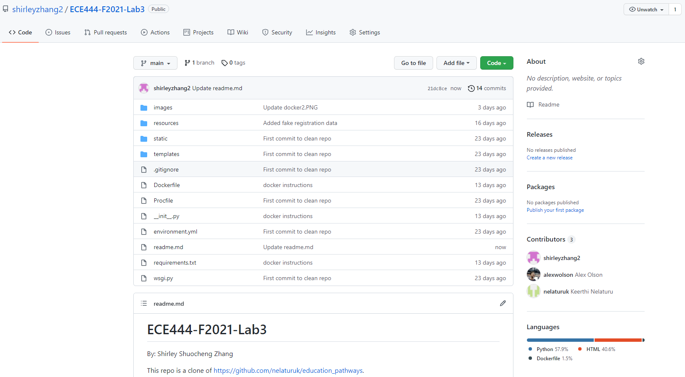

# ECE444-F2021-Lab3
By: Shirley Shuocheng Zhang

This repo is a clone of https://github.com/nelaturuk/education_pathways.

## Activity 1

## Activity 2

## Activity 3

## Activity 4

## Activity 5
One functional requirement that I would like to improve on is the display of prerequisites. Currently, the system displays a list of prerequisites for each course, but it does not give any information on whether those prerequisites have been completed. I would like to implement an additional features to check the completion status given a list of courses that a student has already taken. 

One non-functional requirement that I would like to improve on is usability. For example, I noticed that the navigation bar is absent in the individual course pages, and the only way to exit is to go back to the previous page. I would keep the navigation bar at the top to help the users navigate the website with minimal effort.
